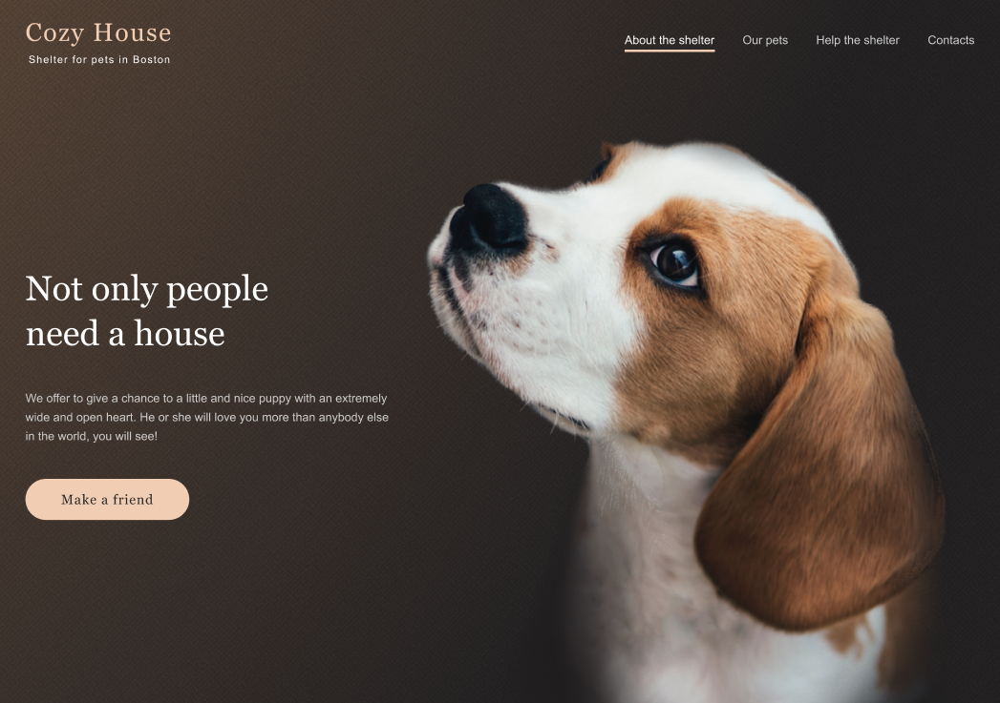

# Shelter

<p align="center">
  
</p>

## Description
This is a project developed as part of the [JS / Front-end course](https://rs.school/courses/javascript-mentoring-program) at [RS School](https://rs.school/). The objective of this project is to create a two-page pixel-perfect adaptive and interactive website.

### Main skills

* Creating valid semantic adaptive layouts;
* Writing maintainable and clean code;
* Exporting styles from [Figma](https://www.figma.com/file/Yk6EnbY63FyG2PJTFkJDMh/shelter?type=design&node-id=94-43&mode=design);
* Implementing specified project functionality using JavaScript.

### Figma design
Take a look at Figma design [here](https://www.figma.com/file/Yk6EnbY63FyG2PJTFkJDMh/shelter?type=design&node-id=94-43&mode=design).

### Implementation steps

This project is broken down into three parts. Each part takes a week to implement.
* [Week-1](https://github.com/rolling-scopes-school/tasks/blob/master/tasks/shelter/shelter-part1.md). **Implementing fixed layout.**

  The objective of this project part is to implement fixed layouts for two pages: ```main``` and ```pets```, specifically targeting the *desktop* screen size, with a minimum width of *1280px*.
* [Week-2](https://github.com/rolling-scopes-school/tasks/blob/master/tasks/shelter/shelter-part2.md). **Adaptive layout.**

  The objective of this part is to implement adaptive layouts targeting all screens up to *mobile* screen size, with a minimum width of *320px*, following these rules:
    - Ensure the content of the pages fits and no horizontal scroll bar occures for any screen sizes.
    - Ensure the pages match the *768px* and *320px* design layouts.
* [Week-3](https://github.com/rolling-scopes-school/tasks/blob/master/tasks/shelter/shelter-part3.md). **Functionality implementation.**

  After completing the two previous parts, implement the following functionalities using JavaScript:
    - Humburger menu on both the ```main``` and ```pets``` pages;
    - Popups for pet cards on both pages;
    - Infinite slider for pets on the ```main``` page;
    - Pagination on the ```pets``` page.

### Technical requirements
* The layout is valid, semantic, and consistent with the Figma design;
* The web application must function correctly on the latest version of the Google Chrome browser;
* Use of CSS frameworks (e.g., ```bootstrap```) is prohibited;
* Use of JS frameworks (e.g., ```Angular```, ```React```, ```Vue```, etc.) is prohibited;
* Use of outdated libraries (e.g., ```jQuery```, etc.) is prohibited;
* Use of TypeScript is prohibited;
* CSS preprocessors (e.g., ```Sass```) and ```normalize.css``` are permitted;
* It is not recommended to reset styles using ```reset.css```;
* Adding layout as an image when creating a screenshot of part of the layout and inserting it into the layout is prohibited.

## Deploy

Find the deployed version of the project [here](https://xeniyamv.github.io/shelter/shelter/).

## Technology Stack
  * **HTML5**
  * **[Sass](https://sass-lang.com/)**: A CSS extension

